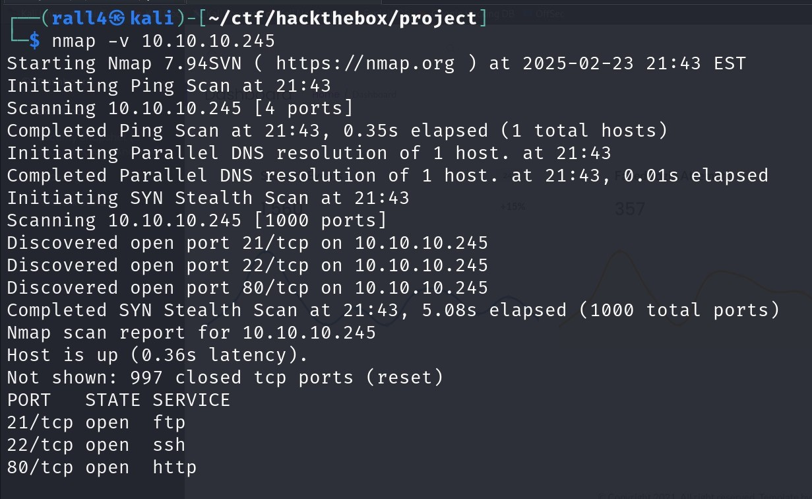
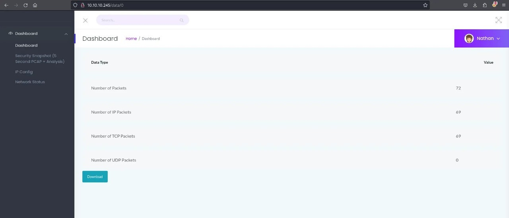
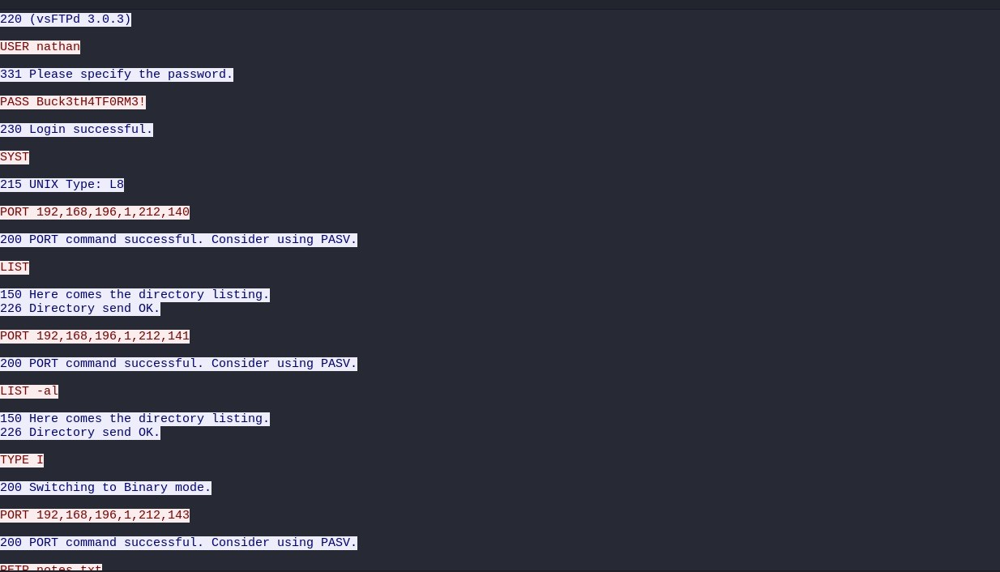
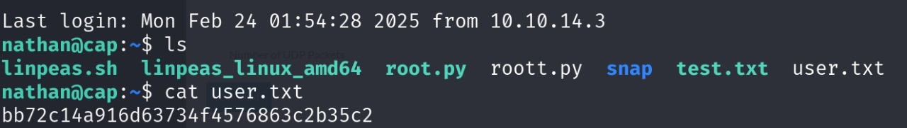
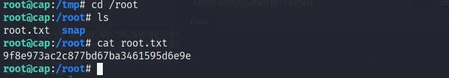

### CAP Machine
A simulated penetration test on the "Cap" machine from Hack The Box, focusing on common vulnerabilities in web applications, network traffic, and Linux capabilities.

### 1. Reconnaissance

Like any good penetration tester, our first step was information gathering.


> **Figure 1:** nmap scan result.


- Identified open ports:
  - `Port 80`: HTTP (Web Application)
  - `Port 21`: FTP
  - `Port 22`: SSH (requires credentials)

---

### 2. Enumeration
Navigated to http://10.10.10.245 and were greeted by a SOC-themed web dashboard. Surprisingly, it didn't ask for credentials — we were automatically logged in as a user named Nathan.

On the dashboard was a .pcap file, a classic capture-the-flag setup. We downloaded and opened it using Wireshark.

Within the traffic logs, we spotted a gem — HTTP credentials in plaintext. The login exchange revealed:


> **Figure 2:** Pcap location on the website.



> **Figure 3:** Pcap location on the website.


- Accessed the web app at `http://10.10.10.245`.
- Downloaded and analyzed `.pcap` file.
- Discovered credentials transmitted over unencrypted HTTP.

---

### 3. Exploitation
Armed with Nathan’s credentials, we turned our attention to SSH.

- SSH access granted using credentials:
  ```bash
  ssh nathan@10.10.10.245

Just navigate to the user.txt file to view the user flag


> **Figure 4:** user flag.

---

### 4. Privilage Escalataion
While browsing the system, we ran the following to inspect binary capabilities:

<pre> ```bash # getcap -r / 2>/dev/null ``` </pre>

Our eyes lit up when we saw:

<pre> ```bash # /usr/bin/python3.8 = cap_setuid+ep ``` </pre>

This meant python3 could run with elevated privileges — a misconfiguration that could be abused for privilege escalation.

We ran the classic Python shell escape to spawn a root shell:

 <pre> ```bash # python3 -c 'import os; os.setuid(0); os.system("/bin/bash")' ``` </pre>

And just like that we became root 


> **Figure 5:** root flag.

  
