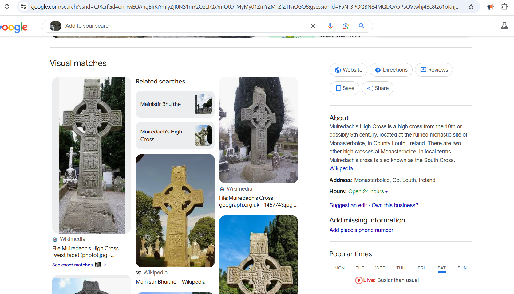

### HTB Apocalypse 2025 OSINT Challenge
I managed to secure two flags from the OSINT challenges namely Echoes in the stone and Stone that wisphers.

## Echoes in the stone

**Date: 18 of March 2025  
Challenge Author(s): Joaquin Iglesias  
Difficulty: easy**
---

We are provided with the following picture:


> **Figure 1:** The Stone.

Our goal is to find the the name of the stone. luckily we have google maps to do that.


By carefully analyzing the details, it is discovered that the cross in the image is known as Muiredach's High Cross, one of the most famous Celtic crosses in Ireland.


> **Figure 2:** The Stone.


Type the flag in this format

```
HTB{name_of_the_cross}
```
---

## The Stone That Whispers

**Date:** 18 of March 2025  
**Challenge Author(s):** Joaquin Iglesias  
**Difficulty:** easy    
---

We are provided with the following picture:


> **Figure 3:** The Whisper.

Our goal is to find the the name of the stone. luckily we have google maps to do that.


The results indicated that the image is associated with a historical monument located on a hill in Ireland named tara's hill. Further inspection revealed that the stone in the image is named Lia Fail. 


> **Figure 4:** The Whisper.

Type the flag in this format

```
HTB{name_of_the_stone}
```
